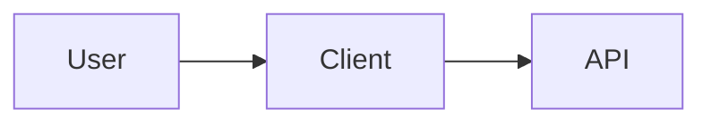
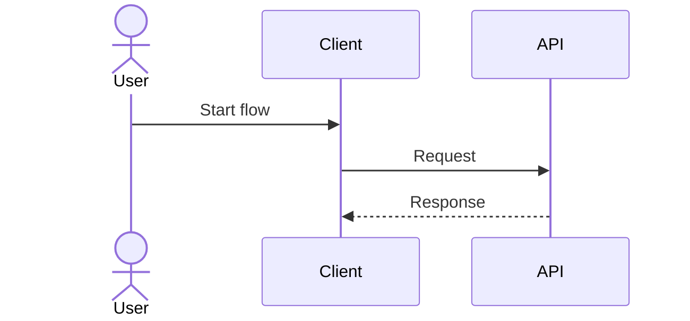
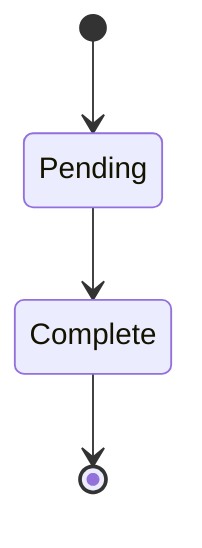
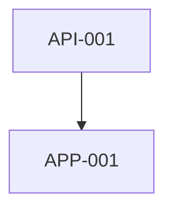

# <Canonical design title>

> This document is the canonical source of truth for `<problem or feature>`.
> Implementation must follow its decisions, contracts, ticket dependencies,
> and acceptance criteria. Update this artifact when the design changes.

## 1. Executive summary

<!-- State the problem, the selected solution, and the user-visible outcome. -->

## 2. Goals

- 

## 3. Non-goals

- 

## 4. Settled constraints

<!-- Record constraints the implementation must not silently reinterpret. -->

- 

## 5. Decision record

| Decision | Selected approach | Why | Rejected alternatives |
| --- | --- | --- | --- |
|  |  |  |  |

## 6. Current-state findings

<!-- Cite concrete repositories, branches, files, and existing behavior. -->

### `finbot-api`

- 

### `finbot`

- 

### `finbot-app`

- 

## 7. Target user flow

<!-- Keep this behavioral. Link to the detailed sequence/state diagrams. -->

1. 

Related diagrams:

- [System context](#diagram-1-system-context)
- [User and system sequence](#diagram-2-user-and-system-sequence)
- [State machine](#diagram-3-state-machine)

## 8. System design

### 8.1 Components and responsibilities

| Component | Repository | Responsibility | Must not do |
| --- | --- | --- | --- |
|  |  |  |  |

### 8.2 Data model

<!-- Define entities, ownership, lifecycle, indexes, and retention. -->

### 8.3 Processing and orchestration

<!-- Define triggers, jobs, idempotency, retries, concurrency, and recovery. -->

### 8.4 Classification or business rules

<!-- Use ordered rules and explicit unresolved/fallback states. -->

### 8.5 Security and privacy

<!-- Cover authentication, authorization, secrets, encryption, and PII. -->

### 8.6 Observability and operations

<!-- Define logs, metrics, alerts, support states, and operator actions. -->

## 9. API and repository contracts

<!-- This section is normative until superseded by checked-in OpenAPI/schema. -->

### 9.1 Endpoint inventory

| Method | Path | Auth | Purpose |
| --- | --- | --- | --- |
|  |  |  |  |

### 9.2 Shared types and examples

```json
{
  "replace": "with representative request and response examples"
}
```

### 9.3 Errors and idempotency

| Condition | Status/code | Client behavior |
| --- | --- | --- |
|  |  |  |

### 9.4 Contract handoff

<!-- Name generated artifacts, fixtures, compatibility checks, and ownership. -->

## 10. UX behavior and failure handling

| State | User sees | Available actions | Exit condition |
| --- | --- | --- | --- |
|  |  |  |  |

## 11. Delivery strategy

Use dependencies, delivery gates, and explicit parallel groups instead of
assuming ticket-number order is implementation order.

### 11.1 Delivery gates

| Gate | Required tickets/artifacts | Unblocks |
| --- | --- | --- |
|  |  |  |

### 11.2 Parallelization rules

- 

### 11.3 Repository branch strategy

- Start each repository from the agreed base branch.
- Keep one implementation ticket per branch and pull request where practical.
- Do not combine unrelated cross-repository work in one ticket.

## 12. Ticket index

| ID | Repository | Title | Depends on | Parallel with | Gate |
| --- | --- | --- | --- | --- | --- |
| API-001 | `finbot-api` |  | None |  |  |
| APP-001 | `finbot` |  |  |  |  |
| INFRA-001 | `finbot-app` |  |  |  |  |

## 13. Implementation tickets

### API-001 — <Imperative ticket title>

- **Repository:** `finbot-api`
- **Depends on:** None
- **Can run in parallel with:** None
- **Objective:** <One independently reviewable outcome.>

#### Scope

- 

#### Out of scope

- 

#### Acceptance criteria

- [ ] 
- [ ] Tests cover 
- [ ] Contract/documentation output is updated

#### Handoff

<!-- Name the durable output consumed by another ticket or agent. -->

### APP-001 — <Imperative ticket title>

- **Repository:** `finbot`
- **Depends on:** 
- **Can run in parallel with:** 
- **Objective:** 

#### Scope

- 

#### Acceptance criteria

- [ ] 

#### Handoff

- 

## 14. Verification strategy

### Unit tests

- 

### Integration tests

- 

### Contract tests

- 

### End-to-end tests

- 

### Manual/platform verification

- 

## 15. Rollout and recovery

<!-- Define migration order, feature flags, compatibility, rollback, and replay. -->

## 16. Risks and mitigations

| Risk | Impact | Mitigation | Detection |
| --- | --- | --- | --- |
|  |  |  |  |

## 17. Open questions

<!-- A canonical artifact should have no implementation-blocking open question. -->

- None.

## 18. Agent handoff requirements

Every implementation prompt should provide:

1. this canonical artifact and the assigned ticket ID;
2. the target repository and base branch;
3. all dependency outputs named by the ticket;
4. the current OpenAPI/schema artifact when contracts are involved;
5. an instruction to implement only the assigned ticket;
6. required tests and acceptance criteria;
7. a request to report deviations instead of silently changing the design.

## Appendix A — Designs and diagrams

The main document links here so diagrams do not interrupt the implementation
flow. Diagrams are normative where their description says so.

### Diagram 1: System context



### Diagram 2: User and system sequence



### Diagram 3: State machine



### Diagram 4: Ticket dependency graph



## Appendix B — References

- 

## Appendix C — Change log

| Date | Change | Reason |
| --- | --- | --- |
| YYYY-MM-DD | Initial draft |  |
