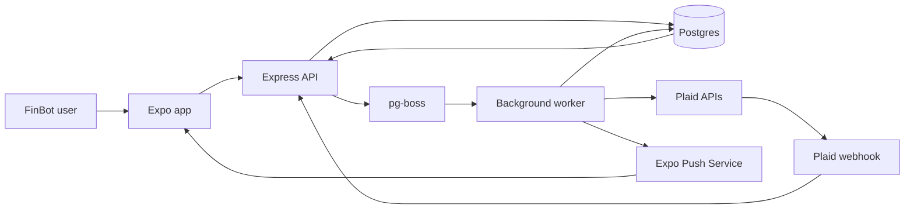
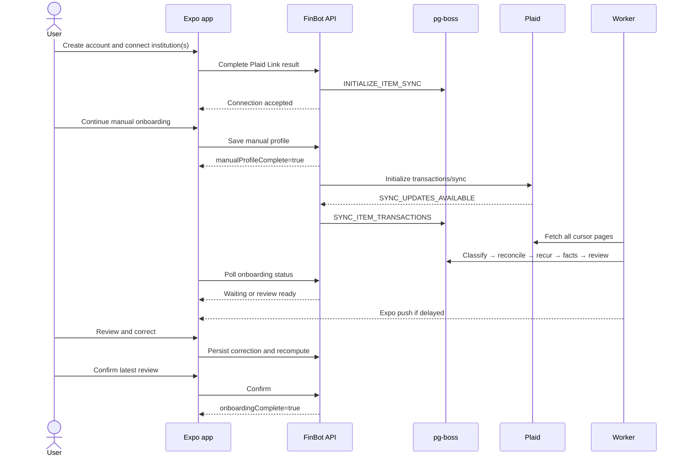
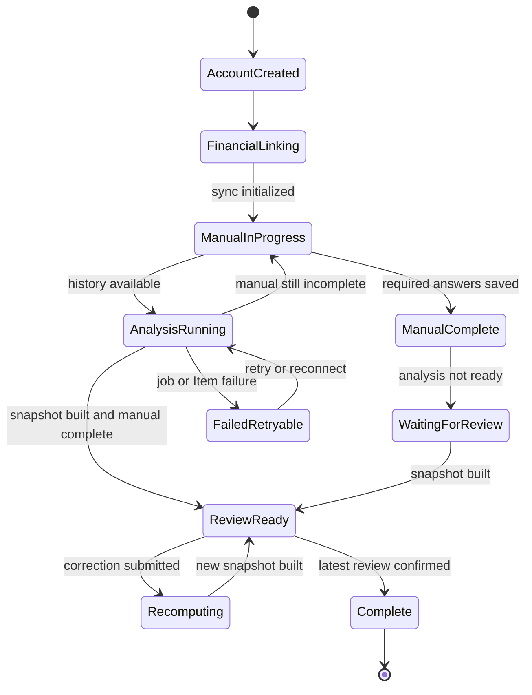
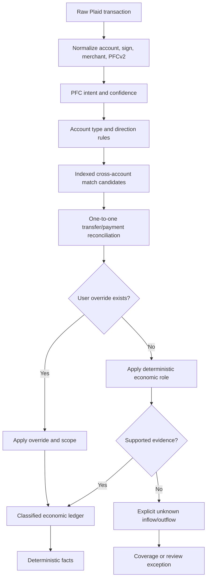
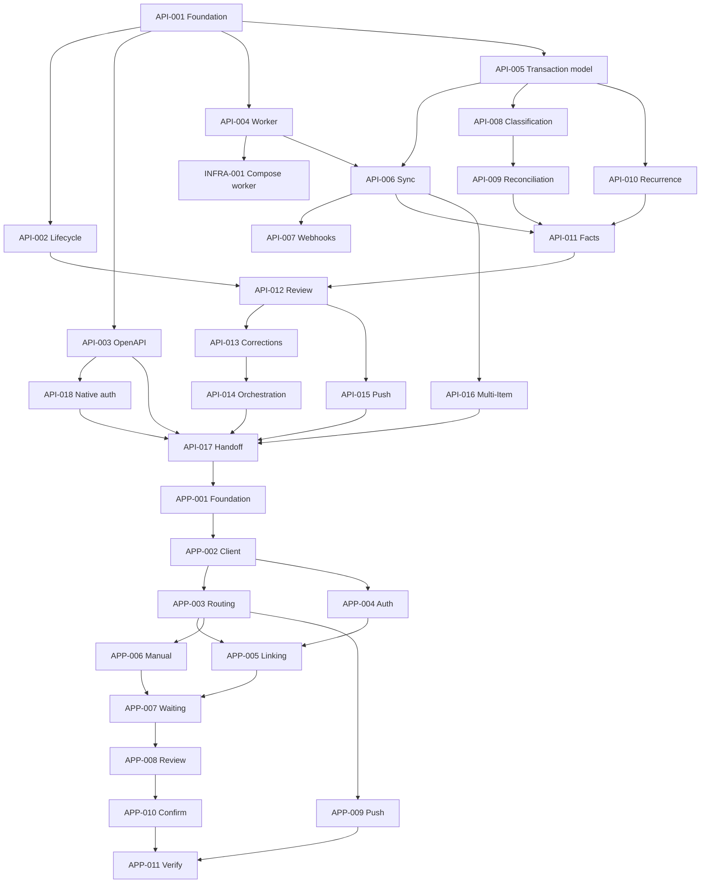

# Financial onboarding and transaction analysis

> This is the canonical cross-repository design and delivery plan for connecting
> financial accounts, analyzing transactions asynchronously, reconciling account
> movements, and completing onboarding through a user-confirmed financial review.

## 1. Executive summary

FinBot will ask users to connect as many relevant financial accounts as
possible before asking them to recall detailed financial amounts. Plaid may
return multiple accounts from one institution and multiple Items across
different institutions. FinBot will request up to 180 days of transactions,
process them asynchronously, classify economic activity separately from account
movements, detect recurring activity locally, compute deterministic facts, and
present a coverage-aware review for correction.

Manual, non-derivable onboarding questions continue while processing runs.
Onboarding is complete only when:

1. required manual answers are saved;
2. financial analysis reaches a reviewable terminal state;
3. the user confirms the financial review.

The API is delivered first. Its OpenAPI document, examples, state machine, and
test evidence form a versioned handoff bundle for frontend implementation.

This problem has **one canonical artifact with separate repository ticket
tracks**. Shared behavior and contracts remain centralized, while individual
tickets are sized for one agent and one reviewable pull request.

## 2. Goals

- Reduce user recall by deriving supported values from connected records.
- Support multiple accounts at one institution and multiple institutions.
- Avoid double-counting credit-card purchases and their checking payments.
- Never classify debt payments, refunds, or transfers as earned income.
- Keep calculations deterministic and auditable outside the language model.
- Allow onboarding to continue while Plaid history is still becoming available.
- Produce an explicit review of aggregates, uncertainties, and missing coverage.
- Preserve user corrections and apply them consistently to future analyses.
- Make background processing durable, retryable, idempotent, and observable.
- Establish an API-first contract that the frontend can consume without type drift.

## 3. Non-goals

- Purchasing Plaid's Recurring Transactions add-on in the initial release.
- Importing CSV files, card statements, or PDFs.
- Using an LLM to classify every transaction.
- Requiring exactly 180 days when an institution has less history available.
- Providing investment transaction analysis.
- Moving money, paying bills, or initiating transfers.
- Building web push notifications; web uses polling and in-app state.
- Completing onboarding without a financial review.
- Redesigning post-onboarding budgeting and chat features beyond the facts contract.

## 4. Settled constraints

- Request up to **180 days** of transaction history.
- Use local recurrence detection built on stored transactions.
- Use Plaid PFCv2 as a classification signal, not an unquestioned truth.
- Use a PostgreSQL-backed job queue; do not add Kafka, RabbitMQ, or Redis.
- Use Expo push notifications when processing takes longer than the configured
  expected window and the review later becomes ready.
- Keep the user in a restricted onboarding shell until review confirmation.
- If fewer than 180 days are available, complete with an explicit coverage limit.
- Build and validate the API before implementing the frontend counterpart.
- Create fresh implementation branches in each affected repository.
- Preserve one source of truth for cross-repository decisions and dependencies.

## 5. Decision record

| Decision | Selected approach | Why | Rejected alternatives |
| --- | --- | --- | --- |
| Artifact organization | One cross-repo artifact with repo-scoped tickets | Prevents contract and state-machine drift | Separate API/frontend plans duplicating shared design |
| Account linking | Multi-account selection and repeated or Multi-Item Link | A complete spending picture commonly spans cards and banks | One "primary bank" connection |
| History | Request up to 180 days | Supports stronger baselines and local recurrence detection | 30-day-only analysis |
| Async execution | `pg-boss` worker over existing Postgres | Durable jobs without another infrastructure service | Kafka, RabbitMQ, Redis/BullMQ, request-thread work |
| Categorization | Deterministic pipeline using PFCv2, account semantics, matching, and overrides | Fast, testable, explainable | Per-transaction LLM calls |
| Card payments | Model purchases as economic spend and payments as account movement | Prevents double-counted spend and phantom income | Counting or dropping all checking payments silently |
| Missing card | External card payment remains a cash obligation and coverage gap | Honest about unseen purchase detail | Guessing categories from the payment |
| Recurrence | Local heuristic over normalized merchants and cadence | Avoids paid add-on while preserving auditability | Plaid Recurring Transactions add-on |
| Contract | OpenAPI 3.1 generated from shared Zod schemas | Existing API already uses Zod; frontend types can be generated | Hand-maintained duplicate TypeScript interfaces |
| Notification | Expo push on delayed completion; polling while foregrounded | Covers set-and-forget without making push the state source | Push-only completion |
| Completion | Manual complete AND analysis reviewable AND review confirmed | Prevents unsupported financial advice | Completing after questionnaire submission |
| Authentication transport | HttpOnly cookie sessions on web; rotating Bearer access/refresh tokens in native SecureStore | Native fetch cannot rely consistently on browser cookie behavior | Putting native tokens in AsyncStorage or relying on accidental cookies |

## 6. Current-state findings

### 6.1 `finbot-api`

- The checked-out `feature/facts-service` branch contains pure deterministic
  computations in `src/services/facts.service.ts`, types in
  `src/types/facts.ts`, and unit tests.
- `summarizeSpend` currently treats every positive Plaid amount as spending and
  every negative amount as income. It has no transfer or account-type context.
- `feature/ingest-onboarding` contains Plaid Link, encrypted access-token
  storage, `plaid_items`, `plaid_accounts`, and manual onboarding persistence.
- The ingest branch does not store or sync transactions.
- The ingest branch marks `users.on_boarding_complete` true immediately after
  saving manual answers, which conflicts with this design.
- Existing migrations were modified on the feature branch. New work must use
  forward-only migrations rather than depending on edited, already-applied SQL.

### 6.2 `finbot`

- The checked-out onboarding branch has a validated seven-step wizard.
- Finance amounts are currently asked before a placeholder connect-bank screen.
- `feature/wire-auth` contains useful real API, Plaid Link, and Hosted Link
  integration, but still models a single primary connection.
- Routing is not driven by server onboarding state.
- Financial waiting, review, corrections, generated API types, and push
  notification features do not exist.

### 6.3 `finbot-app`

- This parent repository owns Docker Compose and shared local configuration.
- Postgres 16 with pgvector is already the persistent infrastructure dependency.
- API and frontend are separate nested Git repositories and are intentionally
  ignored by this parent repository.
- Plaid environment variables are already represented in Compose.

## 7. Target user flow

1. The user creates a FinBot account.
2. FinBot explains why checking accounts and spending cards are needed.
3. Plaid Link allows multiple compatible accounts at the institution.
4. The user may add additional institutions before continuing.
5. FinBot initializes one independent transaction sync per Plaid Item.
6. The user continues household, employment, goal, pool, and risk questions.
7. Plaid webhooks trigger durable transaction sync jobs as history becomes ready.
8. FinBot normalizes and classifies transactions, reconciles transfers and card
   payments, detects recurrence, and computes facts plus coverage.
9. If the manual wizard finishes first, the user sees a waiting/retry screen.
10. If processing exceeds the configured expected window, FinBot sends an Expo
    push when review becomes ready.
11. The review shows aggregates and only the exceptions requiring attention.
12. The user corrects classifications, confirms missing-account limitations, and
    supplies remaining manual financial context.
13. FinBot recomputes affected facts and the user confirms the review.
14. Only then does the API mark onboarding complete and permit the main app.

Detailed views:

- [System architecture](#diagram-1-system-architecture)
- [User and system sequence](#diagram-2-user-and-system-sequence)
- [Onboarding state machine](#diagram-3-onboarding-state-machine)
- [Classification pipeline](#diagram-4-classification-pipeline)
- [Ticket dependencies](#diagram-5-ticket-dependency-graph)

## 8. System design

### 8.1 Components and responsibilities

| Component | Repository | Responsibility | Must not do |
| --- | --- | --- | --- |
| Expo client | `finbot` | Link accounts, collect manual answers, poll status, review and correct, register push token | Calculate authoritative financial totals |
| Express API | `finbot-api` | Authenticate, validate contracts, persist user actions, enqueue work, serve review snapshots | Perform long sync/classification work in requests |
| Background worker | `finbot-api` | Sync Plaid, classify, reconcile, compute snapshots, notify | Depend on a live client session |
| PostgreSQL | Runtime via `finbot-app` | Source of truth, queue storage, cursors, transactions, reviews, corrections | Act as an unbounded raw event archive without retention rules |
| Plaid | External | Account metadata, balances, transaction history, PFCv2, update webhooks | Decide FinBot's final economic classification |
| Expo Push Service | External | Deliver delayed review-ready notifications | Determine onboarding state |
| OpenAPI bundle | Produced by `finbot-api` | Normative frontend contract and examples | Contain undocumented implementation-only fields |

### 8.2 Account and Item model

- One FinBot user has zero or more Plaid Items.
- A Plaid Item normally represents one institution login.
- One Item may expose checking, savings, and multiple credit-card accounts when
  the institution, requested products, and Account Select configuration permit.
- Multiple institutions produce multiple Items with independent access tokens,
  cursors, readiness, errors, and sync jobs.
- Link should require `transactions` for this flow. Products that exclude credit
  accounts, such as required Auth flows, must be optional or separate.
- Duplicate Items must be detected before creating unnecessary access tokens.
- Users explicitly indicate when they are done adding institutions; this records
  declared account coverage without claiming every real-world account is linked.

### 8.3 Data model

All schema changes are forward-only numbered migrations.

#### Existing tables to retain

- `users`: retain `on_boarding_complete` as the final derived gate.
- `user_info`: retain confirmed manual profile answers.
- `plaid_items`: encrypted token and institution connection.
- `plaid_accounts`: account metadata and balance snapshot.

#### Tables or equivalent records to add

| Entity | Required fields and behavior |
| --- | --- |
| `plaid_sync_state` | One row per Item; cursor, update status, initial/historical readiness, oldest date, last sync, last error; row-locked during cursor advancement |
| `plaid_webhook_events` | Deduplication/audit hash, Item, type/code, received/processed timestamps, result |
| `plaid_transactions` | Plaid ID, Item/account FKs, date, authorized date, amount/currency, pending, merchant/name, PFC primary/detail/confidence/version, raw JSONB, modified/removed state |
| `transaction_classifications` | Economic role, display bucket, source, rule version, confidence band, explanation, user override, classified timestamp |
| `transaction_links` | One-to-one or grouped relationship between transfer/payment postings, match score, matching evidence, link type |
| `financial_analysis_runs` | User, requested lookback, status, timing, rule version, triggering Items, error/retry metadata |
| `financial_fact_snapshots` | Versioned deterministic output JSON, source run, coverage JSON, created timestamp |
| `financial_review_items` | Low-confidence or conflicting facts requiring user action; proposed and confirmed values, evidence, status |
| `push_tokens` | User, Expo token, platform, device identifier, enabled/revoked timestamps |

`pg-boss` owns its queue schema. Business status remains in FinBot tables so
product behavior is not coupled to queue internals.

### 8.4 Asynchronous orchestration

#### Job types

1. `INITIALIZE_ITEM_SYNC`
2. `SYNC_ITEM_TRANSACTIONS`
3. `CLASSIFY_USER_TRANSACTIONS`
4. `RECONCILE_USER_TRANSFERS`
5. `DETECT_USER_RECURRING`
6. `BUILD_FINANCIAL_FACTS`
7. `BUILD_FINANCIAL_REVIEW`
8. `SEND_REVIEW_READY_NOTIFICATION`

#### Rules

- API requests enqueue and return; they do not wait for history processing.
- `/transactions/sync` is called once without a cursor to initialize updates.
- `SYNC_UPDATES_AVAILABLE` causes an Item sync job.
- A sync job follows `has_more` pages and commits the resulting cursor only
  with the corresponding transaction changes.
- Only one cursor-advancing job may run per Item.
- Jobs are at-least-once; every handler must be idempotent.
- Added, modified, and removed Plaid records must all be applied.
- User-level analysis is debounced so several Item updates produce one rebuild.
- Initial available data may produce progress, but review is built after every
  active Item reaches a terminal state for the requested run: historical-ready,
  limited-history, or failed.
- An account with fewer than 180 available days is `limited-history`, not stuck.
- At least one active Item must produce reviewable balances or transaction
  history. Additional failed Items become coverage limitations the user can
  resolve or accept; a run with no usable Item cannot be confirmed.
- Retries use bounded exponential backoff. Exhausted work enters a visible
  failed state with a user retry action and operator diagnostics.

### 8.5 Transaction normalization and classification

Raw Plaid records remain immutable evidence except for Plaid's explicit
modified/removed lifecycle. Derived classifications are versioned separately.

#### Economic roles

- `expense`
- `earned_income`
- `refund_or_credit`
- `internal_transfer`
- `credit_card_payment`
- `debt_principal_payment`
- `interest_or_fee`
- `savings_or_investment_transfer`
- `unknown_outflow`
- `unknown_inflow`

#### Ordered classification signals

1. **Plaid PFCv2:** primary, detailed value, version, and confidence.
2. **Account semantics:** type/subtype and Plaid amount sign.
3. **Known deterministic rules:** normalized descriptions and institutions.
4. **Cross-account reconciliation:** scored candidate matches.
5. **User override:** explicit correction always wins for the selected scope.
6. **Fallback:** unresolved inflow/outflow remains explicit.

A negative transaction on a credit account is never earned income, but it is not
automatically a payment. It may be a refund, reward, statement credit, dispute
reversal, or payment.

#### Transfer and credit-card payment matching

Candidate matches must:

- have equal or tolerance-approved absolute amounts and the same currency;
- have opposite directions;
- occur within a configurable date window;
- involve different owned accounts when both sides are available;
- be consistent with account types and PFC/description evidence;
- be selected one-to-one by highest score, not matched many-to-many.

For a connected credit card:

- purchases are economic spending;
- the checking outflow and card credit are linked account movement;
- the payment postings are excluded from spending and income;
- interest and fees posted as card transactions remain economic expense.

For an unlinked card:

- a card-payment-shaped checking outflow is a cash obligation;
- it is excluded from normal categorized purchase spending;
- it becomes `external_card_payment_unattributed` review evidence;
- category-specific advice is limited until the card is connected or the user
  accepts the missing coverage;
- the payment amount is not presented as current-month purchase fact.

### 8.6 Local recurring detection

The existing `detectRecurring` function is a starting point and must be expanded:

- normalize merchant/entity names before grouping;
- analyze recurring inflows and outflows separately;
- require at least three settled occurrences;
- support weekly, biweekly, monthly, quarterly, and annual candidate cadences;
- use median gaps and permitted variance rather than exact dates;
- measure amount variance for utilities and other variable bills;
- exclude internal transfers and card-payment pairs from subscriptions;
- emit evidence, cadence, average/last amount, occurrence count, and confidence band;
- never silently label a low-confidence stream as a confirmed subscription.

### 8.7 Facts and coverage

Facts remain deterministic outputs derived from stored records, not model prose.
The existing facts service is extended or wrapped to consume economically
classified transactions.

Every review snapshot contains two distinct concepts:

- **Calculation correctness:** exact arithmetic over selected stored records.
- **Coverage:** how complete those records are for the requested question.

Coverage dimensions:

| Dimension | Meaning |
| --- | --- |
| Account coverage | Connected account types and user's declared completion of linking |
| History coverage | Oldest settled transaction and available days per Item/account |
| Transfer resolution | Share of transfer-shaped value classified or paired |
| Category coverage | Share of economic spend with supported display categories |
| Freshness | Last successful sync and pending-transaction exposure |
| Institution health | Items complete, limited, degraded, or failed |

The API returns named bands such as `complete`, `partial`, and `insufficient`
with reasons. It does not expose a fake unexplained percentage.

### 8.8 Review and correction model

The review is aggregate-first:

- income estimate and detected income streams;
- spending totals and category breakdown;
- recurring bills and subscriptions;
- liquid balances and connected liabilities;
- external/unattributed card payments;
- missing, limited, or failed account coverage;
- material conflicts between manual answers and observed evidence.

Only actionable exceptions become review items. Corrections may apply to:

- one transaction;
- a normalized merchant for past and future transactions;
- a recurring stream;
- a manual profile fact;
- acceptance of a known coverage limitation.

Each correction stores who changed what, original evidence, selected scope, and
timestamp. Recompute jobs use overrides before producing the next snapshot.

### 8.9 Onboarding completion

`users.on_boarding_complete` is true only when:

```text
manual_profile_complete
AND financial_analysis_reviewable
AND financial_review_confirmed
```

The application remains restricted otherwise. Restricted users may access:

- account connection management;
- manual onboarding;
- processing/waiting state;
- review and corrections when ready;
- retry, help, notification settings, and logout.

They may not access financial advice that assumes completed onboarding.

### 8.10 Push notifications

- The app registers an Expo push token after authentication and permission.
- Processing status remains queryable; push is never the source of truth.
- If review is ready before the configured delay, the foreground app advances
  through polling and no delayed-completion push is required.
- If readiness occurs after the delay and a valid token exists, the worker sends
  one idempotent `financial_review_ready` notification per analysis run/device.
- Tapping the notification deep-links to the review route, which re-fetches status.
- Invalid Expo tokens are revoked from future sends.

### 8.11 Security and privacy

- Plaid access tokens remain encrypted with authenticated encryption at rest.
- Raw financial data and review endpoints are authorized by `req.user.id`.
- Web keeps HttpOnly access/refresh cookies. Native login/register returns
  short-lived access and rotating refresh tokens only for an explicit native
  client flow; the app stores them in Expo SecureStore, sends the access token
  as `Authorization: Bearer`, and rotates/revokes refresh sessions server-side.
- `requireAuth` accepts the web access cookie or the native Bearer access token
  through the same user/authorization path.
- Plaid webhooks are verified before processing.
- Logs exclude access tokens, full raw payloads, and sensitive transaction names.
- Push payloads contain no balances or transaction details.
- User disconnect marks the Item inactive, revokes Plaid access when supported,
  and triggers recomputation without that Item.
- Retention and account-deletion behavior must cover raw transactions,
  classifications, snapshots, push tokens, and queue jobs.

### 8.12 Observability and operations

Structured logs include `userId`, `analysisRunId`, `itemId`, `jobId`, job type,
attempt, duration, and terminal status, while excluding secrets.

Minimum metrics:

- analysis duration from first link to review-ready;
- Plaid readiness and sync duration per institution;
- job success/retry/dead-letter counts;
- transactions added/modified/removed;
- classification distribution and unresolved value;
- transfer resolution rate;
- analysis completion and review confirmation conversion;
- push send, receipt error, and invalid-token counts.

Operators need a read-only analysis status view and safe replay action by run or
Item. Replay must use idempotent handlers rather than database surgery.

## 9. API and repository contracts

OpenAPI 3.1 is generated from or directly shares the route Zod schemas. The API
checks in the generated document and serves the same version at
`GET /openapi.json`. CI fails when generated output differs from source.

### 9.1 Endpoint inventory

| Method | Path | Auth | Purpose |
| --- | --- | --- | --- |
| `POST` | `/plaid/link-token` | User | Start initial, add-institution, or update selection flow |
| `POST` | `/plaid/exchange-public-token` | User | Persist one linked Item and enqueue initialization |
| `POST` | `/plaid/hosted-link/complete` | User | Complete Hosted/Multi-Item results |
| `GET` | `/plaid/connections` | User | List all Items/accounts and health |
| `POST` | `/plaid/webhook` | Plaid signature | Record event and enqueue work |
| `PUT` | `/onboarding/manual` | User | Save manual answers without final completion |
| `GET` | `/onboarding/manual` | User | Resume saved answers |
| `GET` | `/onboarding/status` | User | Return gates, phases, progress, and available actions |
| `GET` | `/onboarding/financial-review` | User | Return latest review snapshot and exceptions |
| `PATCH` | `/onboarding/financial-review/items/:id` | User | Correct or accept one review item |
| `POST` | `/onboarding/financial-review/recompute` | User | Rebuild after corrections when needed |
| `POST` | `/onboarding/financial-review/confirm` | User | Confirm latest review and evaluate final gate |
| `POST` | `/onboarding/retry` | User | Retry an allowed failed analysis phase |
| `POST` | `/notifications/push-tokens` | User | Register/update one Expo token |
| `DELETE` | `/notifications/push-tokens/:tokenId` | User | Revoke one token |
| `GET` | `/openapi.json` | Public or development policy | Published API contract |

### 9.2 Representative status response

```json
{
  "phase": "financial_review_pending",
  "gates": {
    "hasLinkedInstitution": true,
    "linkingDeclaredComplete": true,
    "manualProfileComplete": true,
    "analysisReviewable": false,
    "financialReviewConfirmed": false
  },
  "analysis": {
    "runId": "5b910c92-1890-4dce-8912-0e496d4091a4",
    "status": "waiting_for_history",
    "requestedLookbackDays": 180,
    "institutions": {
      "total": 2,
      "ready": 1,
      "limited": 0,
      "failed": 0
    },
    "startedAt": "2026-08-24T20:00:00Z",
    "reviewReadyAt": null,
    "retryAllowed": false
  },
  "availableActions": [
    "view_waiting",
    "manage_connections",
    "manage_notifications",
    "logout"
  ],
  "onboardingComplete": false
}
```

### 9.3 Representative review response

```json
{
  "reviewId": "5fd0bb04-1826-4444-887d-95974853f623",
  "snapshotVersion": 3,
  "status": "needs_confirmation",
  "period": {
    "requestedDays": 180,
    "oldestObservedDate": "2026-03-04",
    "throughDate": "2026-08-24"
  },
  "coverage": {
    "band": "partial",
    "reasons": [
      {
        "code": "UNLINKED_CARD_PAYMENT",
        "message": "Payments to an unlinked card represent 18% of observed cash outflow."
      }
    ]
  },
  "facts": {
    "monthlyIncomeEstimate": 5200,
    "averageMonthlyEconomicSpend": 3410,
    "averageMonthlyCashObligations": 3890,
    "availableToSpend": 7400
  },
  "recurringStreams": [],
  "categoryTotals": [],
  "reviewItems": [
    {
      "id": "7df09f9d-80f6-4a36-af60-66c768d57917",
      "type": "external_card_payment_unattributed",
      "required": true,
      "evidence": {
        "description": "AUTOPAY CARD PAYMENT",
        "averageMonthlyAmount": 820
      },
      "allowedActions": [
        "connect_account",
        "accept_coverage_limitation"
      ]
    }
  ]
}
```

### 9.4 Errors and idempotency

| Condition | Status/code | Client behavior |
| --- | --- | --- |
| Analysis still running | `409 ANALYSIS_NOT_REVIEWABLE` | Route to waiting and poll |
| Required review items remain | `409 REVIEW_ITEMS_UNRESOLVED` | Highlight required items |
| Confirming stale snapshot | `409 REVIEW_VERSION_STALE` | Refetch latest review |
| Item needs reauthentication | `409 PLAID_ITEM_LOGIN_REQUIRED` | Launch Link update mode |
| Retry currently running | `202 RETRY_ALREADY_QUEUED` | Continue status polling |
| Unsupported correction | `422 INVALID_CORRECTION_SCOPE` | Preserve form and show API error |
| Duplicate webhook/job | Successful no-op | Do not surface to user |

Mutating endpoints that may be retried accept an idempotency key or derive a
stable operation key from user, run, item, and action.

### 9.5 Contract handoff

The completed API produces a checked-in handoff directory containing:

- `openapi.json`;
- generated TypeScript types or a reproducible generation command;
- example successful and error payloads;
- onboarding state/route matrix;
- Plaid Sandbox fixture instructions;
- API commit SHA and schema/rule versions;
- test command and passing test summary;
- known platform limitations.

The frontend agent receives this canonical document, the handoff directory, and
only its assigned `APP-*` ticket. Handwritten DTO duplication is prohibited.

## 10. UX behavior and failure handling

| State | User sees | Available actions | Exit condition |
| --- | --- | --- | --- |
| `financial_linking` | Connected institutions and explanation | Link/add/update, declare done | At least one supported Item and user continues |
| `manual_profile_in_progress` | Non-derivable questions | Save/resume, manage connections | Required manual answers saved |
| `waiting_for_history` | Honest progress without fake percentage | Background app, enable push, manage accounts | Items reach terminal run state |
| `classifying` | Analysis in progress | Same as waiting | Review snapshot produced |
| `review_ready` | Aggregates, coverage, exceptions | Correct, connect missing account, accept limitation | Required review items resolved |
| `recomputing` | Corrections being applied | Wait; retain submitted edits | New snapshot available |
| `failed_retryable` | Institution/phase-specific failure | Retry, reconnect, help | Retry succeeds or account becomes terminal failed |
| `complete` | Main application | Normal product actions | Final gate remains true |

Progress copy uses concrete milestones such as “3 accounts connected” and
“waiting for transaction history,” not invented completion percentages.

## 11. Delivery strategy

### 11.1 Repository strategy

- Create a fresh branch in each repository from the agreed base.
- Integrate the existing API facts and ingest branches before new pipeline work.
- Integrate frontend validation and wire-auth foundations before app tickets.
- Prefer one ticket, one repository, one branch, and one pull request.
- Parent Compose/docs changes remain separate `INFRA-*` tickets.

### 11.2 Delivery gates

| Gate | Required outputs | Unblocks |
| --- | --- | --- |
| G0 Foundations | API and frontend branch foundations reconciled independently | New feature work |
| G1 Durable ingest | Transactions, queue, sync, and webhooks tested | Classification work |
| G2 Financial engine | Classification, reconciliation, recurrence, facts, coverage | Review API |
| G3 API complete | Status, review, corrections, confirmation, push, multi-Item, OpenAPI acceptance | Frontend implementation |
| G4 Frontend integrated | Generated client, routing, linking, waiting, review, push | End-to-end release verification |

### 11.3 Parallelization rules

- API contract/lifecycle, worker foundation, and transaction schema may run in
  parallel after the foundation merge.
- Webhook handling and base classification may run in parallel after sync/schema.
- Recurrence work may run parallel to transfer reconciliation.
- Push delivery and multi-Item hardening may run parallel after orchestration.
- Per the selected API-first strategy, `APP-*` feature tickets begin after G3,
  although the frontend foundation merge can be prepared independently.
- Agents must not begin a ticket until all named dependency handoffs exist.

## 12. Ticket index

| ID | Repository | Title | Depends on | Parallel with |
| --- | --- | --- | --- | --- |
| API-001 | `finbot-api` | Integrate API foundation branches | None | None |
| API-002 | `finbot-api` | Add forward-only lifecycle schema | API-001 | API-003, API-004, API-005 |
| API-003 | `finbot-api` | Establish OpenAPI generation | API-001 | API-002, API-004, API-005 |
| API-004 | `finbot-api` | Add PostgreSQL job worker | API-001 | API-002, API-003, API-005 |
| API-005 | `finbot-api` | Store and normalize Plaid transactions | API-001 | API-002, API-003, API-004 |
| INFRA-001 | `finbot-app` | Run worker in local Compose | API-004 | API-006 |
| API-006 | `finbot-api` | Implement cursor-based transaction sync | API-004, API-005 | INFRA-001 |
| API-007 | `finbot-api` | Process verified Plaid webhooks | API-006 | API-008 |
| API-008 | `finbot-api` | Classify transaction economic roles | API-005 | API-007, API-010 |
| API-009 | `finbot-api` | Reconcile transfers and card payments | API-008 | API-010 |
| API-010 | `finbot-api` | Expand local recurring detection | API-005 | API-008, API-009 |
| API-011 | `finbot-api` | Persist deterministic fact snapshots | API-006, API-009, API-010 | None |
| API-012 | `finbot-api` | Build coverage-aware review snapshots | API-002, API-011 | None |
| API-013 | `finbot-api` | Add review corrections and recomputation | API-012 | API-015 |
| API-014 | `finbot-api` | Orchestrate status and completion gates | API-002, API-006, API-012, API-013 | None |
| API-015 | `finbot-api` | Deliver delayed Expo notifications | API-004, API-012 | API-013, API-016 |
| API-016 | `finbot-api` | Harden multi-Item account management | API-006, API-012 | API-015 |
| API-018 | `finbot-api` | Support secure native Bearer sessions | API-001, API-003 | API-015, API-016 |
| API-017 | `finbot-api` | Freeze and publish frontend handoff | API-003, API-014, API-015, API-016, API-018 | None |
| INFRA-002 | `finbot-app` | Document/configure webhook and push runtime | API-015, API-017 | APP-001 |
| APP-001 | `finbot` | Integrate frontend foundation branches | G3 | INFRA-002 |
| APP-002 | `finbot` | Generate and adopt the API client | API-017, APP-001 | None |
| APP-003 | `finbot` | Add phase-aware onboarding routing | APP-002 | APP-004 |
| APP-004 | `finbot` | Implement reliable native auth transport | API-018, APP-002 | APP-003 |
| APP-005 | `finbot` | Move multi-institution linking early | APP-003, APP-004 | APP-006 |
| APP-006 | `finbot` | Decouple manual onboarding completion | APP-003 | APP-005 |
| APP-007 | `finbot` | Add waiting, retry, and progress UX | APP-005, APP-006 | APP-009 |
| APP-008 | `finbot` | Build aggregate financial review | APP-007 | APP-009 |
| APP-009 | `finbot` | Register push and handle deep links | APP-003, API-015 | APP-007, APP-008 |
| APP-010 | `finbot` | Implement corrections and final confirmation | APP-008 | None |
| APP-011 | `finbot` | Verify full platform flow | APP-009, APP-010 | None |

## 13. Implementation tickets

### API-001 — Integrate API foundation branches

- **Objective:** Create a clean API base containing both Plaid/manual ingest and
  computed facts without losing tests.
- **Scope:** merge the existing feature work; register routes; retain token
  encryption; preserve facts tests; resolve package and embedding-service changes.
- **Acceptance:** all existing tests pass; Docker API boots; Plaid/manual routes
  and facts source coexist; no transaction pipeline is claimed complete.
- **Handoff:** integrated API base commit and branch.

### API-002 — Add forward-only lifecycle schema

- **Objective:** Separate manual completion, analysis, review, and final completion.
- **Scope:** new migrations for corrected enums/context fields, analysis runs,
  review/snapshot entities, and manual-complete state; remove premature final flag.
- **Acceptance:** applied databases migrate forward; `PUT /onboarding/manual`
  never sets final completion; lifecycle transition tests pass.
- **Handoff:** migration IDs and lifecycle repository/service API.

### API-003 — Establish OpenAPI generation

- **Objective:** Make request and response schemas a generated, checked contract.
- **Scope:** Zod/OpenAPI integration, `/openapi.json`, checked spec, examples,
  drift test, error envelope.
- **Acceptance:** generation is deterministic; CI/test fails on stale output;
  current auth, onboarding, and Plaid endpoints are documented.
- **Handoff:** initial `openapi.json` and generation command.

### API-004 — Add PostgreSQL job worker

- **Objective:** Execute durable asynchronous jobs without new infrastructure.
- **Scope:** add `pg-boss`, worker entry point, typed job registry, retries,
  graceful shutdown, structured logging, test harness.
- **Acceptance:** jobs survive API response/process restart; duplicate delivery is
  tolerated; retry exhaustion is observable; worker tests pass.
- **Handoff:** runnable worker and job registration interface.

### API-005 — Store and normalize Plaid transactions

- **Objective:** Persist auditable PFCv2 transaction evidence.
- **Scope:** transaction/sync-state migrations, repositories, raw payload,
  normalized fields, PFC version/confidence, mapper tests.
- **Acceptance:** added/modified/removed lifecycle is representable; unique keys
  prevent duplicates; sign and PFC mappings are tested.
- **Handoff:** transaction repository and normalized domain type.

### INFRA-001 — Run worker in local Compose

- **Objective:** Make API and worker run from the same image with separate commands.
- **Scope:** Compose service, health/restart behavior, environment, local docs.
- **Acceptance:** `docker compose up --build` runs DB, API, worker, and web; worker
  waits for DB and shuts down cleanly.
- **Handoff:** reproducible local worker runtime.

### API-006 — Implement cursor-based transaction sync

- **Objective:** Import up to 180 available days independently for every Item.
- **Scope:** initial sync, `has_more`, cursor transactionality, one-Item lock,
  account refresh, job chaining, limited-history metadata.
- **Acceptance:** mocked pagination and cursor crash recovery tests pass; link
  completion enqueues initialization; no duplicate records after replay.
- **Handoff:** Item sync job and readiness state.

### API-007 — Process verified Plaid webhooks

- **Objective:** Turn transaction availability and Item events into durable work.
- **Scope:** webhook verification, audit/deduplication, update event handlers,
  fast response, fixtures.
- **Acceptance:** duplicate events are safe; valid sync events enqueue one logical
  update; invalid signatures are rejected; handlers do not perform long work.
- **Handoff:** production webhook endpoint and event fixtures.

### API-008 — Classify transaction economic roles

- **Objective:** Distinguish economic activity from account movement.
- **Scope:** ordered rule engine, PFC/account semantics, rule version, evidence,
  fallback roles, override precedence.
- **Acceptance:** fixtures cover purchases, payroll, refunds, fees, card credits,
  unknowns, and false-income prevention.
- **Handoff:** versioned classification service and repository.

### API-009 — Reconcile transfers and card payments

- **Objective:** Link related postings and prevent double counting.
- **Scope:** indexed candidate generation, scoring, one-to-one matching,
  connected/unlinked card behavior, persisted links.
- **Acceptance:** checking-to-card, checking-to-savings, refunds, near-date false
  matches, carried-balance examples, and replay are tested.
- **Handoff:** reconciled ledger consumed by facts.

### API-010 — Expand local recurring detection

- **Objective:** Detect useful recurring streams without Plaid's add-on.
- **Scope:** merchant normalization, incoming/outgoing streams, cadence classes,
  variable amounts, confidence/evidence, transfer exclusions.
- **Acceptance:** 180-day fixtures cover payroll, subscriptions, utilities,
  annual charges, and non-recurring lookalikes.
- **Handoff:** recurring stream domain output.

### API-011 — Persist deterministic fact snapshots

- **Objective:** Compute review facts from stored, reconciled data.
- **Scope:** adapt facts input, monthly normalization, balances, recurrence,
  snapshot versioning and rebuild job.
- **Acceptance:** no live Plaid dependency in read path; snapshot is reproducible;
  existing facts tests remain green; transfers are excluded correctly.
- **Handoff:** versioned financial fact snapshot.

### API-012 — Build coverage-aware review snapshots

- **Objective:** Produce aggregate-first review data and actionable exceptions.
- **Scope:** coverage bands/reasons, manual-vs-observed conflicts, external card
  gaps, required review items, review endpoint.
- **Acceptance:** partial history and failed/unlinked account scenarios are
  explicit; no fake confidence percentage; OpenAPI examples updated.
- **Handoff:** stable review response contract.

### API-013 — Add review corrections and recomputation

- **Objective:** Persist corrections with scope and rebuild affected facts.
- **Scope:** review-item patching, transaction/merchant/stream/manual scopes,
  audit fields, recompute job, stale version detection.
- **Acceptance:** user cannot edit another user's review; replay preserves
  overrides; stale confirmation returns a conflict.
- **Handoff:** corrected latest review snapshot.

### API-014 — Orchestrate status and completion gates

- **Objective:** Expose one authoritative onboarding state machine.
- **Scope:** status endpoint, available actions, terminal Item aggregation,
  retries, confirmation endpoint, auth user status.
- **Acceptance:** every state transition is tested; final completion is impossible
  before all three gates; confirmation is idempotent.
- **Handoff:** finalized state/route matrix.

### API-015 — Deliver delayed Expo notifications

- **Objective:** Notify backgrounded users when delayed analysis becomes reviewable.
- **Scope:** token registration/revocation, Expo adapter, delay policy,
  idempotent send records, invalid-token handling.
- **Acceptance:** no sensitive payload content; mocked Expo tests pass; only one
  logical ready notification is sent per run/device after delay.
- **Handoff:** push API contract and notification payload example.

### API-016 — Harden multi-Item account management

- **Objective:** Make multiple institutions and account-selection updates reliable.
- **Scope:** all connections response, add institution, update mode, duplicate
  detection, disconnect/recompute, cross-Item coverage.
- **Acceptance:** Sandbox tests cover two Items and multiple accounts; cursors do
  not interfere; facts update after disconnect.
- **Handoff:** final Plaid connection contract and fixtures.

### API-018 — Support secure native Bearer sessions

- **Objective:** Make authenticated API access deterministic on native clients.
- **Scope:** explicit native login/register response, short-lived Bearer access
  tokens, rotating refresh tokens, hashed/revocable refresh sessions,
  `requireAuth` dual transport, OpenAPI security schemes.
- **Acceptance:** web cookies remain HttpOnly; native refresh rotation and logout
  revocation are tested; tokens never appear in logs; the same authorization
  checks apply to both transports.
- **Handoff:** native auth contract consumed by APP-004.

### API-017 — Freeze and publish frontend handoff

- **Objective:** Prove API completeness before app implementation begins.
- **Scope:** end-to-end mocked/Sandbox flow, contract freeze, examples,
  generated types command, test summary, known limitations.
- **Acceptance:** G3 criteria pass from clean setup; handoff bundle names the API
  commit and schema/rule versions; no undocumented frontend DTO is required.
- **Handoff:** versioned frontend handoff directory.

### INFRA-002 — Document and configure webhook and push runtime

- **Objective:** Make external callbacks and worker settings reproducible.
- **Scope:** Compose/env examples for webhook URL, queue, analysis delay, Expo
  credentials placeholders, redirect URLs, operational guide.
- **Acceptance:** no secret is committed; local Sandbox setup is documented;
  production seams and platform limitations are explicit.
- **Handoff:** environment contract consumed by app/device verification.

### APP-001 — Integrate frontend foundation branches

- **Objective:** Preserve real auth/Plaid wiring and per-step validation in one base.
- **Scope:** reconcile `feature/wire-auth` and onboarding validation work; retain
  Hosted/native Link launchers and API client.
- **Acceptance:** current tests/lint pass; no mock auth remains; no new financial
  review UI is included.
- **Handoff:** integrated app base.

### APP-002 — Generate and adopt the API client

- **Objective:** Consume API-017 without handwritten contract duplication.
- **Scope:** codegen script, generated types/client, feature wrappers, error mapping.
- **Acceptance:** generation is reproducible from handoff OpenAPI; old duplicate
  DTOs are removed or isolated; build/typecheck passes.
- **Handoff:** typed client used by subsequent tickets.

### APP-003 — Add phase-aware onboarding routing

- **Objective:** Route every authenticated user from API state.
- **Scope:** status provider, cold-start/foreground refresh, route matrix,
  restricted shell.
- **Acceptance:** fixtures cover linking, manual, waiting, review, failed, and
  complete states with no redirect loop.
- **Handoff:** server-driven navigation foundation.

### APP-004 — Implement reliable native auth transport

- **Objective:** Make protected API calls reliable on web and native devices.
- **Scope:** implement the API-selected Bearer/cookie transport, refresh behavior,
  logout cleanup, physical-device configuration.
- **Acceptance:** iOS/Android development build and web can restore and refresh a
  session; protected Plaid/onboarding calls do not rely on accidental cookies.
- **Handoff:** authenticated generated client transport.

### APP-005 — Move multi-institution linking early

- **Objective:** Collect relevant accounts before numeric finance questions.
- **Scope:** explanation, account/institution list, add another institution,
  update selection, declared-done action.
- **Acceptance:** multiple Sandbox institutions and multiple same-institution
  accounts render; user can recover from Link errors.
- **Handoff:** analysis begins while manual onboarding continues.

### APP-006 — Decouple manual onboarding completion

- **Objective:** Save non-derivable answers without unlocking the app.
- **Scope:** reorder steps, submit/resume manual profile, remove old connect-bank
  destination, rely on API gates.
- **Acceptance:** wizard completion sets manual gate only; saved answers resume;
  numeric fields that review will derive are confirmed at review time.
- **Handoff:** manual-complete state feeding waiting/review routing.

### APP-007 — Add waiting, retry, and progress UX

- **Objective:** Give users a useful restricted state while analysis runs.
- **Scope:** milestone polling/backoff, app foreground refresh, retry/reconnect,
  notification permission prompt, support/logout actions.
- **Acceptance:** no fake percentage; transient API failures retain state; ready
  automatically routes to review.
- **Handoff:** stable async onboarding experience.

### APP-008 — Build aggregate financial review

- **Objective:** Present facts, coverage, and actionable exceptions clearly.
- **Scope:** income/spend/cash distinction, recurrence, balances, category totals,
  coverage explanations, required review items.
- **Acceptance:** partial and insufficient coverage are visible; no transaction
  dump is required for normal review; accessibility labels and loading/errors exist.
- **Handoff:** review view ready for correction controls.

### APP-009 — Register push and handle deep links

- **Objective:** Return delayed users directly to the current review state.
- **Scope:** Expo permission/token lifecycle, foreground handling, background tap,
  `finbot://onboarding/review`, logout revocation.
- **Acceptance:** development builds receive test push; a cold-start tap refetches
  status before routing; web falls back to polling.
- **Handoff:** platform notification and link configuration.

### APP-010 — Implement corrections and final confirmation

- **Objective:** Resolve required review items and complete onboarding safely.
- **Scope:** correction forms/scopes, recompute state, stale review refresh,
  confirmation and final routing.
- **Acceptance:** unresolved required items block confirm; stale versions recover;
  main app opens only after API reports complete.
- **Handoff:** completed user-facing onboarding flow.

### APP-011 — Verify full platform flow

- **Objective:** Validate the released behavior across supported clients.
- **Scope:** web Hosted Link, Android/iOS native Link and OAuth, multi-Item,
  delayed push, retries, corrections, final gate.
- **Acceptance:** test matrix is recorded against API-017; critical failures are
  fixed in their owning ticket/repository rather than patched around in UI.
- **Handoff:** release-readiness evidence.

## 14. Verification strategy

### Unit

- Plaid normalization and sign conventions.
- Economic-role classification and fallback.
- Pair scoring and one-to-one selection.
- Recurrence cadence and amount variance.
- Coverage band/reason generation.
- Onboarding state transition guards.

### Integration

- Migration upgrade from current applied schema.
- `pg-boss` enqueue, retry, restart, and idempotency.
- Cursor pagination with add/modify/remove and crash recovery.
- Webhook verification and deduplication.
- Corrections causing deterministic snapshot replacement.
- Push adapter with mocked Expo responses.

### Contract

- OpenAPI generation drift test.
- Request/response examples validated against schemas.
- Frontend generated types compile against fixtures.
- Error envelopes and state values are exhaustive.

### End to end

- One institution with checking plus multiple cards.
- Two institutions with independent cursor timing.
- Card purchase and matched checking payment counted once.
- Unlinked external card payment creates coverage exception.
- Less than 180 days completes as limited history.
- Manual wizard finishes before analysis and enters waiting.
- Delayed completion sends one push and opens review.
- Correction recomputes facts; confirmation unlocks app.

## 15. Rollout and recovery

- Land forward migrations before code that writes new records.
- Keep current users incomplete unless migrated through an explicit policy.
- Initially run analysis only for onboarding users; avoid automatic backfill.
- Version classification rules and snapshots so results can be rebuilt.
- Use a feature flag for final route enforcement until Sandbox and platform
  verification are complete.
- Rollback application code without rolling back destructive migrations.
- Disable workers to stop new processing while preserving queued jobs.
- Replay failed runs after remediation through supported idempotent job entrypoints.

## 16. Risks and mitigations

| Risk | Impact | Mitigation | Detection |
| --- | --- | --- | --- |
| Institution returns incomplete history | Weak review | Terminal limited-history status and coverage reason | Available-day metrics |
| Auth product hides credit accounts | Incorrect Link selection | Require Transactions; separate optional Auth flow | Account subtype coverage tests |
| Duplicate or concurrent sync | Cursor/data corruption | Per-Item lock, transactional cursor, unique IDs | Replay/concurrency tests |
| False transfer match | Missing real spend/income | Scored evidence, one-to-one matching, review exceptions | Match confidence and correction rate |
| Unlinked credit card | Category undercount | External card obligation bucket and required review item | Unattributed outflow share |
| User permanently blocked by Plaid failure | Abandonment | Retry/reconnect/help and terminal failed state; product monitors | Time-in-state and failure conversion |
| OpenAPI drifts from runtime | Frontend failures | Generate from Zod and CI drift check | Contract tests |
| Push arrives after state changes | Wrong route | Refetch status on tap; push is not source of truth | Deep-link integration tests |
| Queue retry duplicates side effects | Duplicate snapshots/push | Idempotency keys and unique send/run constraints | Job replay tests |
| Logs expose financial data | Privacy incident | Structured allowlist and redaction | Log review/security tests |

## 17. Open questions

No question blocks implementation. Tunable values such as match date windows,
coverage thresholds, and delayed-push timing are configuration defaults validated
with Sandbox/fixture data rather than new product decisions.

## 18. Agent handoff requirements

Every agent receives:

1. this canonical artifact;
2. exactly one ticket ID;
3. the target repository and fresh base branch;
4. dependency commit SHAs and handoff outputs;
5. the current OpenAPI/handoff bundle when applicable;
6. instructions to implement only ticket scope and acceptance criteria;
7. required test commands;
8. an instruction to report design deviations instead of silently changing them.

Agents working in parallel must not edit the same repository branch. Each agent
uses its own ticket branch and returns a reviewable PR or commit for dependency
integration.

## Appendix A — Designs and diagrams

### Diagram 1: System architecture



Normative point: the API serves persisted state and enqueues work; the worker
owns external synchronization and analysis.

### Diagram 2: User and system sequence



### Diagram 3: Onboarding state machine



Normative point: manual and analysis progress independently; only review
confirmation reaches `Complete`.

### Diagram 4: Classification pipeline



### Diagram 5: Ticket dependency graph



## Appendix B — References

- [Plaid Link Account Select](https://plaid.com/docs/link/customization/#account-select)
- [Plaid Multi-Item Link](https://plaid.com/docs/link/multi-item-link/)
- [Plaid Transactions](https://plaid.com/docs/transactions/)
- [Plaid transaction webhooks](https://plaid.com/docs/transactions/webhooks/)
- [Plaid PFC migration](https://plaid.com/docs/transactions/pfc-migration/)
- [Plaid Liabilities](https://plaid.com/docs/liabilities/)
- `finbot-api/src/types/facts.ts`
- `finbot-api/src/services/facts.service.ts`
- `finbot/src/features/onboarding/`
- `finbot/src/features/connect-bank/`

## Appendix C — Change log

| Date | Change | Reason |
| --- | --- | --- |
| 2026-08-24 | Initial canonical artifact | Consolidated the agreed API-first financial onboarding design and agent-sized delivery plan |
| 2026-08-26 | Implementation delivered: all API-*, INFRA-*, and APP-* tickets on `feature/onboarding2.0` in `finbot-api`, `finbot-app`, and `finbot` | G0–G4 executed API-first; handoff bundle in `finbot-api/handoff/`; device/Sandbox verification matrix in `finbot/docs/onboarding-verification.md` |
